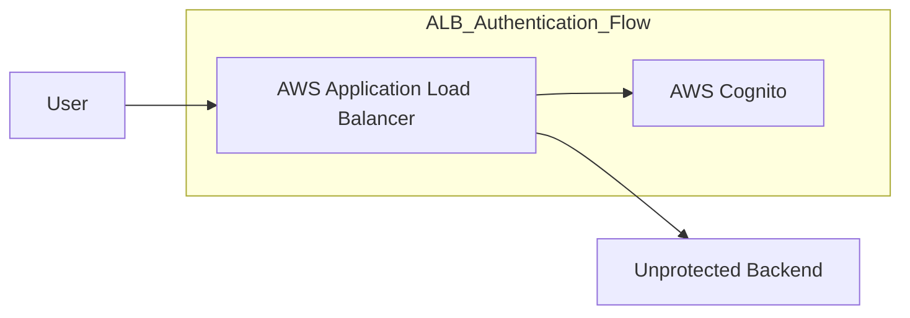

# aws-alb-cognito-auth
AWS example app that adds Cognito authentication at the Application Load Balancer level. Useful for adding security to unprotected backend.

### Diagram
This diagram illustrates the flow of a user/client connecting to an AWS Application Load Balancer (ALB) that has Cognito authentication in place. The ALB directs traffic to an unprotected backend, but the ALB itself handles authentication.

* request is not passed to the backend until the authentication is complete

### Links
* https://docs.aws.amazon.com/elasticloadbalancing/latest/application/listener-authenticate-users.html
